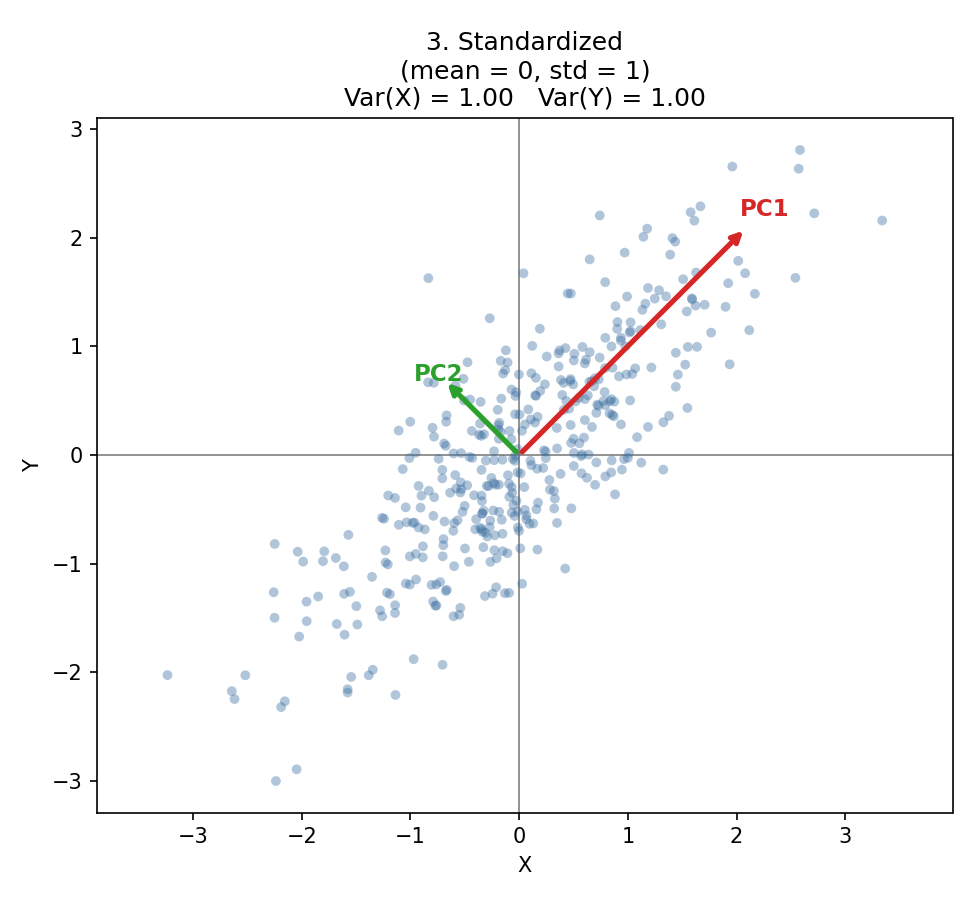
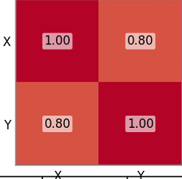
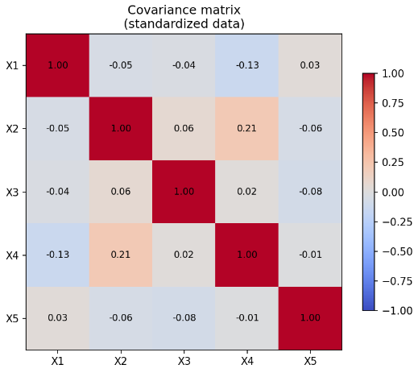
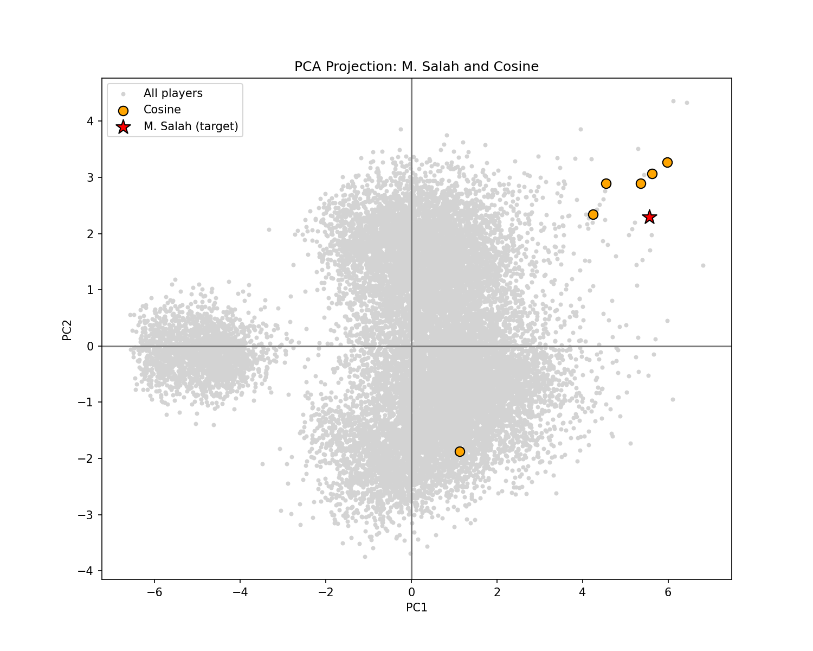
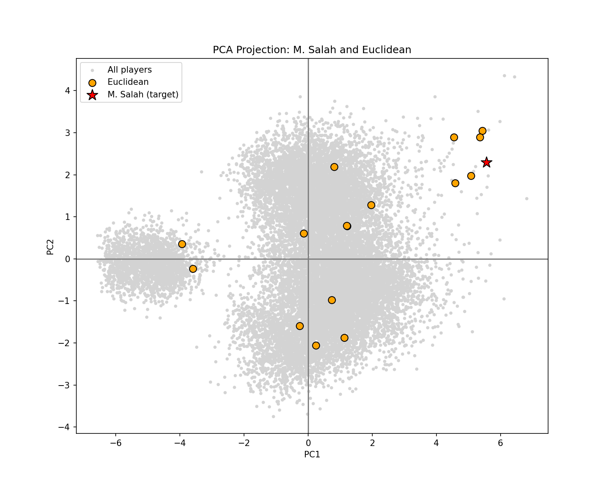
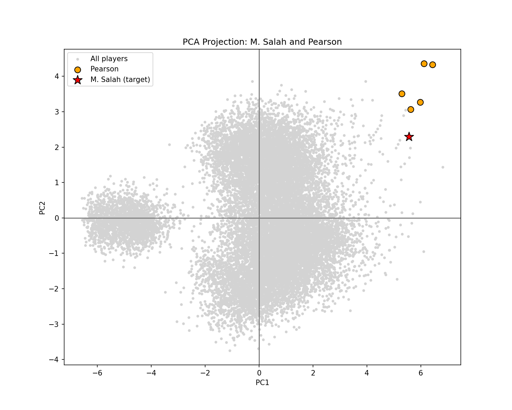

### PCA

PCA helps to correlate variables together to see how close someone is to another by taking a percentage of each feature together

`E.X (0.32 * Stamina + 0.67 * Dribbling + ...)`

By doing this you can compare every feature relative to it's effectiveness

# EIGENVALUES & EIGENVECTORS

- Eigenvectors :
  These are the vectors we use instead of the x and y axis to have a relation between more than 2 features

When they are multiplied with the covergance matrix it doesn't change its direction but rather changes it's value which is called (Eigenvalue)

They make us be able to have a visual understanding of how close/far 2 things are without looking at raw data

- Eigenvalues :
  These tell you how much variance (spread) is packed along each eigenvector's direction. A big eigenvalue = that direction holds a lot of the real information/variation in the data. A tiny eigenvalue = that direction is basically just noise, barely any real spread happens there.

The relationship between the two is this equation:

`A @ v = λ * v`

Where `A` is the covariance matrix, `v` is the eigenvector, and `λ` (lambda) is the eigenvalue. In plain words: when you multiply the covariance matrix by an eigenvector, you don't rotate it to a new direction, you just stretch or shrink it by a factor of `λ`. That's the whole definition of an eigenvector: a direction that survives the transformation unchanged, only scaled.

# How does PCA work

Let's say you have a table for players data consisting of (minute played), (shots), (passes) and (player rating), let's call them A,B,C and Y respectively

|     | A   | B   | C   | Y   |
| --- | --- | --- | --- | --- |
| Player 1 | A_1 | B_1 | C_1 | Y_1 |
| Player 2 | A_2 | B_2 | C_2 | Y_2 |
| ... | ... | ... | ... | ... |

And you want to see what is the closest player to someone you chose 
You can look at every player on the datalist to see who is the closest, but what if you have 1000+ players' data, this is where PCA comes to the rescue

In the beginning, we need to clean up the data from any N.A values and format Anything that is not just a number

This cleans the data from any N.A

```python
cleany = df.dropna(subset= required_cols)
```

This formats the money to remove the Signs

```python
df["Value"] = df["Value"].apply(money)
```

Then we turn the Matrix into an array to be able to perform mathematical operation

```python
X = cleany[self.cols].to_numpy()
```

This gets the mean ( sum / number of items )

```python
mean = X.mean(axis=0)
```

This gets the std of the matrix ( ∑( x - mean )² )/ n -1

```python
std = X.std(axis=0, ddof=1) 
# axis = 0 means we trun an (9,9) matrix into a (1,9) matrix
ddof = 1 means we divide by (n-1) instead of n
```

Then we subtract the from every cell in the matrix the mean and then we decide my the std

```python
X_std = (X - mean) / std 
```

## Why do we do this

- obviously we can't imagine more than 3 axis/features so i am explaining on only 2 to make it easier
  

Let's have a visual representation to make this understandable


This is a raw data with only 2 features ( which means only 2 axis , X and Y )

And the red star is the mean of the whole data

Our objective is to get the points at (0,0) to make it easier to analysis


We got it by subtracting every feature by its mean value

Now, we want to standardize the points, in this example the range of points at X [-15 : 15] is bigger than the range of points at Y [-5 : 5] , so the model would give X a bigger weight , we do this because PCA looks for the most variance feature to make it the most important one



---

now we need to get the relation between every feature with each other

we do that by multiplying the the Transpose of the std matrix to the matrix its self and we divide it my n-1



this is also what will look like for 5 features



(any feature would have a full effect on itself)

the reason we get teh covariance matrix is to get the EIGENVECTORS

# EIGENVALUES & EIGENVECTORS

in the previous picture


the PC1 and PC2 are eigenvectors, which basically mean the new axis that we take into consideration when we want to know how close someone is to another

this script gets the eigenvectors and values and evaluating which 2 eigenvectors has the most variance (information)

```python
        eigenvalues, eigenvectors = np.linalg.eig(X_cov)
        eigenvalues = eigenvalues.real
        eigenvectors = eigenvectors.real

        sort_idx = np.argsort(eigenvalues)[::-1]
        eigenvalues_sorted = eigenvalues[sort_idx]
        eigenvectors_sorted = eigenvectors[:, sort_idx]

        explained_variance_ratio = eigenvalues_sorted / eigenvalues_sorted.sum()

        projection_matrix = eigenvectors_sorted[:, :self.n_components]
```

this turns the data relation between player_rating and features into player_rating and PC1,PC2

```python
scores = X_std @ projection_matrix
```

---

# Usage of PCA

we can use PCA to look for who is the closest to someone if we know their data

we must use one of these methods

note : every measurement is between **FEATURES** and not **PC1 and PC2**

1. **Cosine Similarity** : measures the cosine of the angle between the vector of the players and the vector of the targeted player by getting the ration between the dot product and the product of both lengths , getting a 1 (cos = 1 , theta = 0) mean they are on the same direction so (HIGHER IS BETTER)
  

note : there is a point down because it computes the angle from multiple features not PC1 and PC2



2. **Euclidean distance** : measure the distance between the targeted player and each play by this equation $d_{Euclidean} = \sqrt{(x_2 - x_1)^2 + (y_2 - y_1)^2}$ so (LOWER IS BETTER)
  



3. **Manhattan distance** : measure the distance between the targeted player and each play by this equation $d_{Manhattan} = \vert{}x_2 - x_1\vert{} + \vert{}y_2 - y_1\vert{}$ so (LOWER IS BETTER)
  


notice that at Euclidean and Manhattan have almost exactly the same points

4. **Pearson correlation** : it averages all of the players features and the targeted player features by subtracting the mean
  

```python
        X_centered = X - X.mean(axis=1, keepdims=True)
        t_centered = target - target.mean()
```

then it does the same thing we did in the cosine Similarity




## FINAL SCORE


### Raw (unstandardized) features

| Rank | Cosine (↑ better) | Euclidean (↓ better) | Manhattan (↓ better) | Pearson (↑ better) |
|------|--------------------|-----------------------|-----------------------|----------------------|
| 1 | Coutinho — 1.0000 | Coutinho — 26.08 | J. Rodríguez — 60 | E. Hazard — 1.0000 |
| 2 | J. Rodríguez — 1.0000 | J. Rodríguez — 29.90 | Coutinho — 66 | Neymar Jr — 1.0000 |
| 3 | L. Sané — 1.0000 | J. Oblak — 1,500,000.01 | J. Oblak — 1,500,358 | K. Mbappé — 1.0000 |
| 4 | Bernardo Silva — 1.0000 | L. Modrić — 2,500,000.00 | L. Modrić — 2,500,127 | P. Dybala — 1.0000 |
| 5 | C. Eriksen — 1.0000 | De Gea — 2,500,000.00 | De Gea — 2,500,307 | L. Messi — 1.0000 |

### Standardized (z-score) features

| Rank | Cosine (↑ better) | Euclidean (↓ better) | Manhattan (↓ better) | Pearson (↑ better) |
|------|--------------------|-----------------------|-----------------------|----------------------|
| 1 | K. Mbappé — 0.9968 | Coutinho — 1.63 | J. Rodríguez — 3.82 | E. Hazard — 0.9982 |
| 2 | Marco Asensio — 0.9953 | A. Griezmann — 1.96 | A. Griezmann — 3.90 | K. Mbappé — 0.9981 |
| 3 | A. Griezmann — 0.9946 | J. Rodríguez — 1.97 | K. Mbappé — 3.93 | Neymar Jr — 0.9980 |
| 4 | E. Hazard — 0.9939 | L. Sané — 2.02 | Coutinho — 4.00 | P. Dybala — 0.9975 |
| 5 | L. Sané — 0.9934 | C. Ronaldo — 2.07 | L. Sané — 4.41 | L. Messi — 0.9971 |

### Final shortlist — votes across the 4 standardized metrics

| Player | Metrics matched |
|--------|------------------|
| K. Mbappé | 3/4 |
| A. Griezmann | 3/4 |
| L. Sané | 3/4 |
| E. Hazard | 2/4 |
| Coutinho | 2/4 |


## Conclusion 

Based on the data , Euclidean and Manhattan methods are the best for unstandaridized data
Cosine and Pearson are better for standardized data
